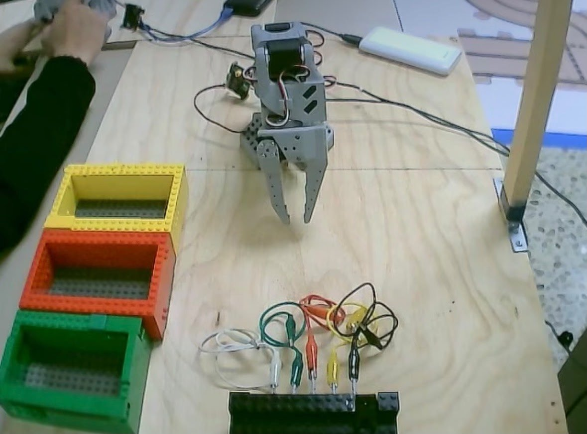
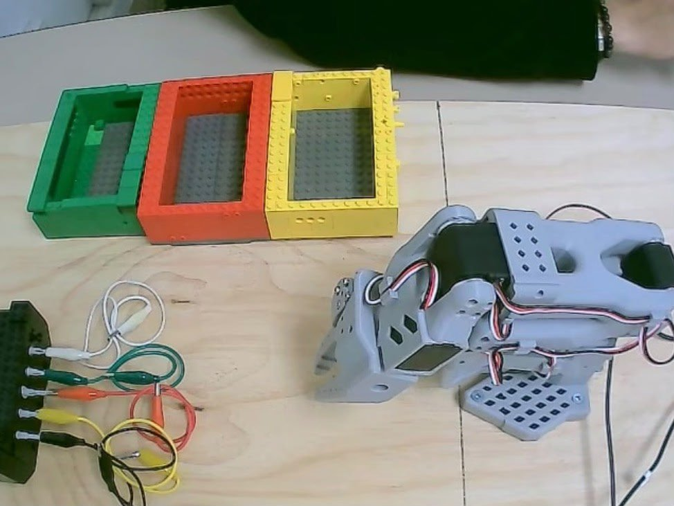
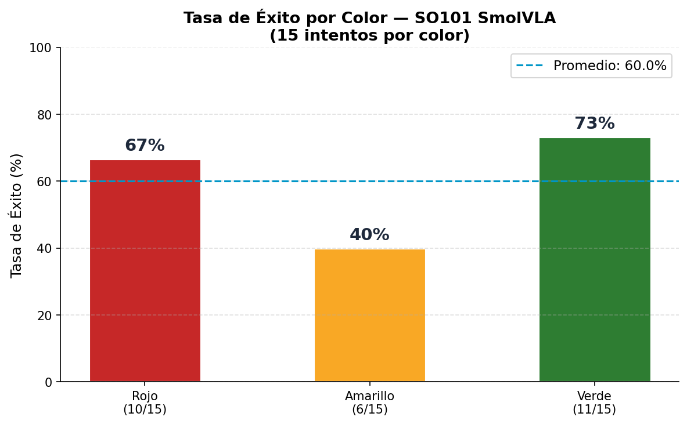
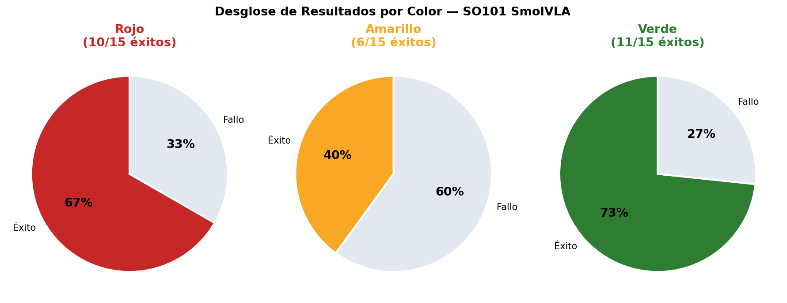
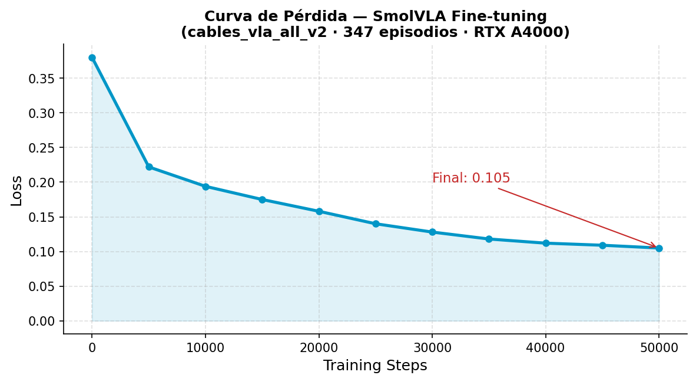

# SO101 Robot — Clasificación de Cables por Color con SmolVLA

**Instituto Tecnológico de Estudios Superiores de Monterrey — Campus Monterrey**  
**Implementación de Robótica Inteligente · Prof. Nezih N. · 2026**

---

## Equipo

| Nombre | Matrícula |
|--------|-----------|
| Valentina González Benedossi | A00839507 |
| Oscar Carranza Hernández | A00838649 |
| Ricardo Gaspar Ochoa | A00838841 |
| Rhett Nieto Ramírez | A01286100 |

---

## 1. Introducción

Este proyecto implementa un sistema de manipulación robótica dextral para el robot SO101 usando el modelo **SmolVLA** (HuggingFace, 2025) — un modelo Vision-Language-Action de 500M parámetros.

**Track:** Track 2 — Vision-Language-Action  
**Opción:** Opción 2 — Laboratory Setup with Clip Wires

El robot aprende a desconectar pinzas de cocodrilo de colores de una barra de conexiones y colocarlas en la caja Lego del color correspondiente, usando únicamente visión e instrucciones de lenguaje natural.

---

## 2. Formulación del Problema

La política VLA se formula como:

```
π_θ(o_t, l, s_t) → A_t
```

Donde:
- `o_t` — imágenes RGB de 2 cámaras (640×480, 10 FPS)
- `l` — instrucción de lenguaje natural (color objetivo)
- `s_t` — estado articular del robot (6 DOF)
- `A_t` — chunk de 50 acciones predichas

**Clases:** Rojo · Amarillo · Verde  
**Criterio de éxito:** El robot desconecta la pinza indicada y la coloca en la caja correcta.

---

## 3. Entorno de Grabación

| Vista superior (cámara top) | Vista lateral (cámara front) |
|:---:|:---:|
|  |  |

El set-up incluye el robot SO-101, una barra de conexiones con cables de colores (rojo, amarillo, verde) y cajas Lego de clasificación por color.

---

## 4. Dataset

| Propiedad | Valor |
|-----------|-------|
| Total de episodios | 453 (151 por color) |
| Clases | Rojo · Amarillo · Verde |
| Cámaras | 2 (frontal + lateral) |
| Resolución | 640×480 px |
| FPS | 10 |
| Formato | LeRobot v3.0 (parquet + video AV1) |

### Links a los datasets

| Dataset | Link |
|---------|------|
| 🔴 Rojo | [Oscarcarrh/cables_vla_red_v2](https://huggingface.co/datasets/Oscarcarrh/cables_vla_red_v2) |
| 🟡 Amarillo | [Oscarcarrh/cables_vla_yellow_v2](https://huggingface.co/datasets/Oscarcarrh/cables_vla_yellow_v2) |
| 🟢 Verde | [Oscarcarrh/cables_vla_green_v2](https://huggingface.co/datasets/Oscarcarrh/cables_vla_green_v2) |
| 🌐 Unificado | [Oscarcarrh/cables_vla_all_v2](https://huggingface.co/datasets/Oscarcarrh/cables_vla_all_v2) |

### Modelo entrenado

[Oscarcarrh/so101-cables-smolvla-all-v2](https://huggingface.co/Oscarcarrh/so101-cables-smolvla-all-v2)

Instrucciones de tarea usadas:
```
"remove the red cable and place it in the red box"
"remove the yellow cable and place it in the yellow box"
"remove the green cable and place it in the green box"
```

---

## 5. Metodología — SmolVLA

SmolVLA combina un **Vision-Language Model** (SmolVLM2-500M) con un **Action Expert** entrenado con Flow Matching:

```
Cámaras (front + side) ──► SmolVLM2 Visual Encoder (congelado)
Instrucción de lenguaje ──►          ↓
                              tokens visuales + lingüísticos
Estado articular (6 DOF) ──►         ↓
                              Action Expert (100M params, fine-tuned)
                                       ↓
                              Chunk de 50 acciones → Robot SO101
```

El Action Expert usa **Flow Matching**:

```
A_t^τ = τ·A_t + (1 − τ)·ε
```

Donde `A_t` son las acciones expertas, `ε` es ruido y `τ` controla la interpolación.

### Parámetros de entrenamiento

| Parámetro | Valor |
|-----------|-------|
| Steps | 50,000 |
| Batch size | 32 |
| Learning rate | 1e-4 |
| Scheduler | Cosine decay with warmup |
| GPU | NVIDIA RTX A4000 16GB |
| Tiempo | ~11 horas |
| Parámetros entrenables | 100M / 450M |
| Loss final | 0.105 |

---

## 6. Resultados

### Tasa de éxito (15 intentos por color)

| Color | Éxitos | Total | Tasa |
|-------|--------|-------|------|
| 🔴 Rojo | 10 | 15 | **67%** |
| 🟡 Amarillo | 6 | 15 | **40%** |
| 🟢 Verde | 11 | 15 | **73%** |
| **Promedio** | **27** | **45** | **60%** |

### Gráficas de evaluación

| Tasa de éxito por color | Desglose por color |
|:---:|:---:|
|  |  |

### Curva de pérdida durante entrenamiento



---

## 7. Videos de Demostración

### Demo — Todos los colores

https://github.com/KyrosTEC/So101_VLA/raw/main/results/videos/demo_all_colors.mp4

> Para verlo directamente: [demo_all_colors.mp4](results/videos/demo_all_colors.mp4)

### Demo por color individual

| Color | Video |
|-------|-------|
| 🔴 Rojo | [demo_red.mp4](results/videos/demo_red.mp4) |
| 🟡 Amarillo | [demo_yellow.mp4](results/videos/demo_yellow.mp4)  |
| 🟢 Verde | [demo_green.mp4](results/videos/demo_green.mp4) |

---

## 8. Instalación

### Opción A — Local

```bash
git clone https://github.com/KyrosTEC/So101_VLA.git
cd So101_VLA
pip install -r requirements.txt
```

### Opción B — Docker (recomendado)

```bash
docker build -t so101-vla .
docker run --gpus all -v $(pwd)/results:/app/results so101-vla
```

**Requisitos:** Python 3.12 · CUDA 12.5+ · Ubuntu 20.04+

---

## 9. Grabación del Dataset

```bash
# Verificar cámaras
bash scripts/setup_cameras.sh

# Grabar episodios VLA por color
bash scripts/record_vla.sh red 151
bash scripts/record_vla.sh yellow 151
bash scripts/record_vla.sh green 151
```

---

## 10. Entrenamiento

```bash
# Descargar dataset
hf download Oscarcarrh/cables_vla_all_v2 \
  --repo-type dataset --local-dir ./data/cables_vla_all_v2

# Entrenar
python scripts/train.py \
  --dataset_repo_id Oscarcarrh/cables_vla_all_v2 \
  --dataset_root ./data/cables_vla_all_v2 \
  --steps 50000 --batch_size 32
```

---

## 11. Evaluación

```bash
# Evaluar en robot físico
python scripts/evaluate.py --color red --num_episodes 15

# Modo offline (sin robot)
python scripts/evaluate.py --color red --offline
```

---

## 12. Docker

```bash
docker build -t so101-intelligent-control .

docker run --rm -it \
  -v $(pwd)/results:/app/results \
  so101-intelligent-control

# Con GPU
docker run --gpus all \
  -v $(pwd)/data:/app/data \
  -v $(pwd)/results:/app/results \
  so101-intelligent-control python scripts/train.py
```

---

## 13. Discusión y Limitaciones

**Lo que aprendió el modelo:**
- Se dirige consistentemente hacia la zona correcta según el color indicado
- Genera trayectorias similares a las demostraciones expertas
- Distingue los tres colores mediante la instrucción de lenguaje

**Limitación principal — distribution shift:**
> El robot llega cerca del cable pero no logra el agarre fino. Esto se debe a que pequeños errores de posición acumulados llevan al robot a estados que no vio durante el entrenamiento, afectando especialmente la etapa de agarre.

**Otras limitaciones:**
- Ambiente de grabación no completamente limpio
- Inferencia a ~3 Hz vs 10 FPS de entrenamiento
- Sin demostraciones de recuperación ante fallos

---

## 14. Estructura del Repositorio

```
So101_VLA/
├── README.md
├── Dockerfile
├── docker-compose.yml
├── requirements.txt
├── .gitignore
├── scripts/
│   ├── record_vla.sh
│   ├── record_il.sh
│   ├── setup_cameras.sh
│   ├── train.py
│   ├── evaluate.py
│   └── run_demo.py
├── src/
│   ├── preprocessing/
│   ├── training/
│   ├── evaluation/
│   └── robot_execution/
├── data/
│   └── dataset_link.md
├── results/
│   ├── plots/
│   │   ├── success_rate.png
│   │   ├── results_breakdown.png
│   │   └── training_loss.png
│   ├── videos/
│   │   └── demo_all_colors.mp4
│   └── setup_top.png / setup_side.png
├── tests/
│   └── test_core_modules.py
└── docs/
```

---

## 15. Referencias

- HuggingFace LeRobot Team. *SmolVLA: A Vision-Language-Action Model for Affordable and Efficient Robotics*. arXiv:2506.01844, 2025.
- Zhao et al. *Learning Fine-Grained Bimanual Manipulation with Low-Cost Hardware (ACT)*. arXiv:2304.13705, 2023.
- HuggingFace. *LeRobot Documentation*. https://huggingface.co/docs/lerobot
